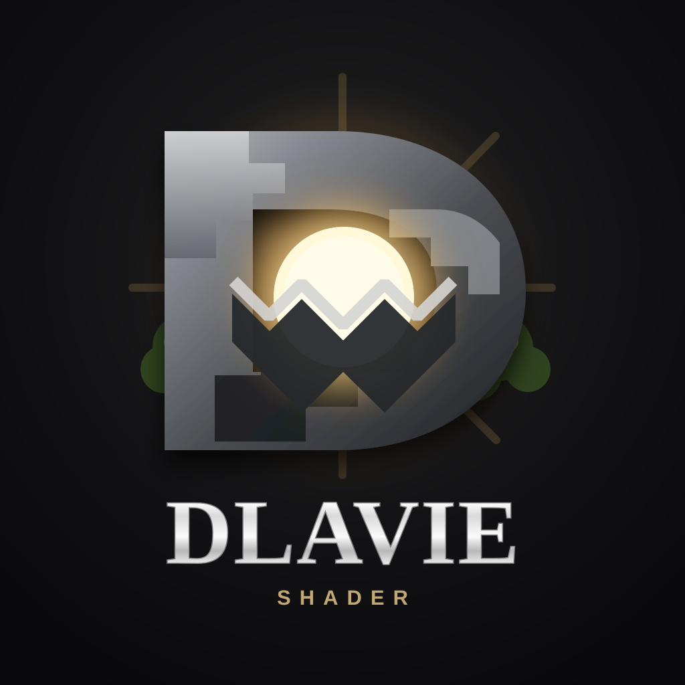

<p align="center">
  
</p>

<h1 align="center">DLavie Shader</h1>

<p align="center"><strong>Vibrant Visuals · PBR Enhanced · Mobile First</strong></p>

DLavie Shader is a long-term Minecraft Bedrock shader/resource-pack project built around the official **Vibrant Visuals** and **PBR** pipeline. Its art direction targets cinematic clarity, expressive skies, soft lighting, terrain-aware volumetric light shafts and a vanilla-faithful PBR material feel while remaining designed for Bedrock mobile.

> **Important:** DLavie Shader is an original Bedrock implementation. Other shader/resource packs are visual references only; DLavie does not redistribute their source code or copyrighted assets.

## v0.1.3 — Mobile Lighting Pass

- Expanded colored lighting to 36 common vanilla emitters, including every candle color, end rods, beacons, magma, respawn anchors and jack o'lanterns.
- Medium now uses a hybrid local-light budget: small nearby emitters receive dynamic point lights while broad emitters stay static to limit overdraw and heat on iPhone 11.
- Low retains static lights; High and Ultra enable point lighting for the complete authored palette.

### Rendering scope

Bedrock resource packs cannot directly run Java Edition GLSL. DLavie recreates the visual direction with supported Vibrant Visuals controls, so an exact 100% pixel match with Derivative is not technically possible. Fog/light shafts, sun response, reflections, water waves, time-of-day color, local lights and engine-driven moving clouds are tuned together; cloud geometry and motion remain controlled by Bedrock itself.

The compatibility target is Minecraft Bedrock **26.4x (including 26.45)** on iOS. Mojang's current public Vibrant Visuals resources still use the stable `1.21.40`–`1.21.120` component schemas; those component schema numbers are intentionally retained rather than being replaced with the marketing release number.

### Previous: Godrays Pass

- Added true Vibrant Visuals **volumetric fog + terrain-aware light shafts** instead of relying only on sky glare.
- Sunlight can form visible shafts through leaves, windows, cave openings, roofs and narrow terrain gaps.
- Added Henyey-Greenstein forward scattering to make the shafts directional rather than turning the whole scene into white fog.
- Preserves vanilla fog identifiers, fog distance, underwater colors and authored biome-specific properties.
- Nether and End keep dimension-correct fog; Overworld sunlight shafts are not injected into those dimensions.
- Rebuilt sun Mie and glare values as time-of-day keyframes: readable at noon, strongest around sunrise/sunset, almost absent at midnight.
- Low / Medium / High / Ultra now include different volumetric intensity profiles.

## Quality presets

| Preset | Target | Godrays | Water | Caustics | Shadows |
|---|---|---|---|---|---|
| Low | FPS / thermals | Light | Flat | Off | Blocky |
| Medium | Mobile balanced | Natural | 8-octave waves | Off | Soft |
| High | Strong phones/tablets | Strong | 16-octave waves | On | Soft |
| Ultra | Screenshots / headroom | Cinematic | 28-octave waves | Strong | Soft |

**Recommended first choice on iPhone:** Medium. High is the preferred preset for judging the new godrays; Ultra intentionally pushes the light shafts harder.

## Install / use

1. Build or obtain `DLavie-Shader-v0.1.3.mcpack` from an authenticated/trusted file source.
2. Open the `.mcpack` with Minecraft.
3. Activate **DLavie Shader** in Global Resources or the world resource packs.
4. Enable **Vibrant Visuals** in Minecraft's Video settings.
5. Open the pack's gear / Pack Settings and choose Low, Medium, High, or Ultra.

### Important for private GitHub repositories

Do not rely on an unauthenticated `github.com/.../raw/...mcpack` link from iOS. If the repository is private, GitHub can return an HTML/login response while the saved filename still ends in `.mcpack`. Minecraft then reports **"cannot find manifest in pack"** because the downloaded file is not the actual ZIP resource pack.

## Developer build

```bash
python3 scripts/validate_pack.py
python3 scripts/build_mcpack.py
```

The build automatically:

1. preserves and binds the current vanilla client-biome definitions;
2. downloads current vanilla fog definitions and adds DLavie's tiered volumetric-lighting layer;
3. packages only valid resource-pack content; and
4. verifies the manifest plus generated fog overrides before completing.

For debugging the generators independently:

```bash
python3 scripts/sync_vanilla_biomes.py --out biomes
python3 scripts/sync_vanilla_fogs.py --root .
```

## Project principles

1. **Mobile first, not mobile only.** Every visual feature must have a sensible performance tier.
2. **Vanilla-faithful materials.** PBR should enrich vanilla textures instead of replacing Minecraft's visual identity.
3. **Original implementation.** Learn from excellent shaders and PBR packs; do not clone their code or assets.
4. **Reproducible builds.** A release should be buildable from the repository.
5. **No fake toggles.** A quality option must correspond to a real resource override.
6. **PBR grows incrementally.** Authored per-block normal/MERS assets are added in reviewed sets.
7. **Visual consistency.** Overworld, Nether and End each receive an intentional palette rather than accidental defaults.

See [docs/ARCHITECTURE.md](docs/ARCHITECTURE.md) and [docs/ROADMAP.md](docs/ROADMAP.md).
